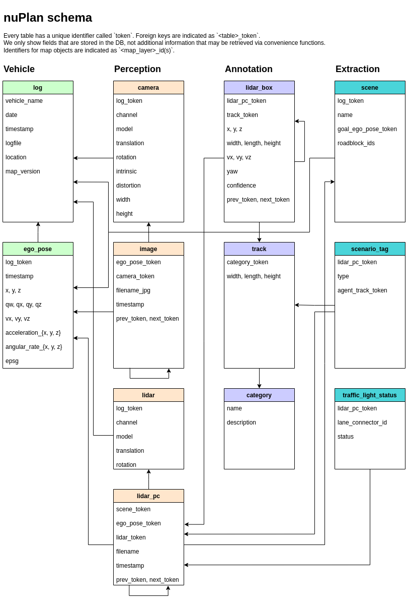

nuPlan Schema
==========

This document describes the database schema used in nuPlan. All annotations and metadata (including calibration, maps, 
vehicle coordinates etc.) are covered in relational databases. The database
tables are listed below. Every row can be identified by its unique primary key `token`. Foreign keys such as `log_token` 
are used to link to the `token` of the table `log`. 



log
---------
Information about the log from which the data was extracted.
```
log {
   "token":                        <str> -- Unique record identifier.
   "vehicle_name":                 <str> -- Vehicle name.
   "date":                         <str> -- Date (YYYY-MM-DD).
   "timestamp":                    <int> -- Unix timestamp for when the log started.
   "logfile":                      <str> -- Original log file name.
   "location":                     <str> -- Area where log was captured, e.g. Singapore.
   "map_version":                  <str> -- Name of map version used in this log.
}
```


ego_pose
---------
Ego vehicle pose at a particular timestamp.
```
ego_pose {
   "token":                        <str> -- Unique record identifier.
   "log_token":                    <str> -- Foreign key. Identifies the log which this ego pose is a part of.
   "timestamp":                    <str> -- Unix timestamp.
   "x":                            <float> -- Ego vehicle location center_x in global coordinates(in meters).
   "y":                            <float> -- Ego vehicle location center_y in global coordinates(in meters).
   "z":                            <float> -- Ego vehicle location center_z in global coordinates(in meters).
   "qw":                           <float> -- Ego vehicle orientation in quaternions in global coordinates.
   "qx":                           <float> -- Ego vehicle orientation in quaternions in global coordinates.
   "qy":                           <float> -- Ego vehicle orientation in quaternions in global coordinates.
   "qz":                           <float> -- Ego vehicle orientation in quaternions in global coordinates.
   "vx":                           <float> -- Ego vehicle velocity x in local coordinates(in m/s).
   "vy":                           <float> -- Ego vehicle velocity y in local coordinates(in m/s).
   "vz":                           <float> -- Ego vehicle velocity z in local coordinate(in m/s)s.
   "acceleration_x":               <float> -- Ego vehicle acceleration x in local coordinates(in m/s2).
   "acceleration_y":               <float> -- Ego vehicle acceleration y in local coordinates(in m/s2).
   "acceleration_z":               <float> -- Ego vehicle acceleration z in local coordinates(in m/s2).
   "angular_rate_x":               <float> -- Ego vehicle angular rate x in local coordinates.
   "angular_rate_y":               <float> -- Ego vehicle angular rate y in local coordinates.
   "angular_rate_z":               <float> -- Ego vehicle angular rate z in local coordinates.
   "epsg":                         <int> -- Ego vehicle epsg. Epsg is a latitude/longitude coordinate system based on the Earth's center of mass.
}
```


camera
---------
The `camera` table contains information about the calibration and other settings of a particular camera in a particular log. 
```
camera {
   "token":                        <str> -- Unique record identifier.
   "log_token":                    <str> -- Foreign key. Identifies the log that uses the configuration specified here.
   "channel":                      <str> -- The camera name, which describes it's position on the car (e.g. 'CAM_F0', 'CAM_R0', 'CAM_R1', 'CAM_R2', 'CAM_B0', 'CAM_L0', 'CAM_L1', 'CAM_L2').
   "model":                        <str> -- The camera model used.
   "translation":                  <float> [3] -- The extrinsic translation of the camera relative to the ego vehicle coordinate frame. Coordinate system origin in meters: x, y, z.
   "rotation":                     <float> [4] -- The extrinsic rotation of the camera relative to the ego vehicle coordinate frame. Coordinate system orientation as quaternion: w, x, y, z.
   "intrinsic":                    <float> [3, 3] -- Intrinsic camera calibration matrix.
   "distortion":                   <float> [*] -- The camera distortion parameters according to the Caltech model (k1, k2, p1, p2, k3)
   "width":                        <int> -- The width of the camera image in pixels.
   "height":                       <int> -- The height of the camera image in pixels.           
}
```


image
---------
The `image` table stores metadata to retrieve a single image taken from a camera.  It does not store the image itself.
```
image {
   "token":                        <str> -- Unique record identifier.
   "next_token":                   <str> -- Foreign key. Record that follows this in time. Empty if last image of log.
   "prev_token":                   <str> -- Foreign key. Record that precedes this in time. Empty if first image of log.
   "ego_pose_token":               <str> -- Foreign key. Indicates the ego pose at the time that the image was captured.
   "camera_token":                 <str> -- Foreign key. Indicates the camera settings used to capture the image.
   "filename_jpg":                 <str> -- Relative path to image file.
   "timestamp":                    <int> -- Unix timestamp.
}
```


lidar
---------
The `lidar` table contains information about the calibration and other settings of a particular lidar in a particular log.
```
lidar {
   "token":                        <str> -- Unique record identifier.
   "log_token":                    <str> -- Foreign key. Identifies the log that uses the configuration specified here.
   "channel":                      <str> -- Log channel name.
   "model":                        <str> -- The lidar model.
   "translation":                  <float> [3] -- The extrinsic translation of the lidar relative to the ego vehicle coordinate frame. Coordinate system origin in meters: x, y, z.
   "rotation":                     <float> [4] -- The extrinsic rotation of the lidar relative to the ego vehicle coordinate frame. Coordinate system orientation as quaternion: w, x, y, z.
}
```


lidar_pc
---------
The `lidar_pc` table stores metadata to retrieve a single pointcloud taken from a lidar.
It does not store the pointcloud itself.
The pointcloud combines sweeps from multiple different lidars that are aggregated on the car.
```
lidar_pc {
   "token":                        <str> -- Unique record identifier.
   "next_token":                   <str> -- Foreign key. Record that follows this in time. Empty if end of log.
   "prev_token":                   <str> -- Foreign key. Record that precedes this in time. Empty if start of log.
   "scene_token":                  <str> -- Foreign key. References the scene that contains this lidar_pc.
   "ego_pose_token":               <str> -- Foreign key. Indicates the ego pose at the time that the pointcloud was captured.
   "lidar_token":                  <str> -- Foreign key. Indicates the lidar settings used to capture the pointcloud.
   "filename":                     <str> -- Relative path to pointcloud blob.
   "timestamp":                    <int> -- Unix timestamp.
}
```


lidar_box
---------
The `lidar_box` table stores individual object annotations in the form of 3d bounding boxes.
These boxes are extracted from an Offline Perception system and tracked across time using the `track` table.
Since the perception system uses lidar as an input modality, all `lidar_boxes` are linked to the `lidar_pc` table.
```
lidar_box {
   "token":                        <str> -- Unique record identifier.
   "lidar_pc_token":               <str> -- Foreign key. References the lidar_pc where this object box was detected.
   "track_token":                  <str> -- Foreign key. References the object track that this box was associated with.
   "next_token":                   <str> -- Foreign key. Record that follows this in time. Empty if end of track.
   "prev_token":                   <str> -- Foreign key. Record that precedes this in time. Empty if start of track.
   "x":                            <float> -- Bounding box location center_x in global coordinates(in meters).
   "y":                            <float> -- Bounding box location center_y in global coordinates(in meters).
   "z":                            <float> -- Bounding box location center_z in global coordinates(in meters).
   "width":                        <float> -- Bounding box size width(in meters).
   "length":                       <float> -- Bounding box size length(in meters).
   "height":                       <float> -- Bounding box size height(in meters).
   "vx":                           <float> -- Bounding box velocity v_x(in m/s). This quantity is estimated by a Neural Network and may be inconsistent with future positions.
   "vy":                           <float> -- Bounding box velocity v_y(in m/s). This quantity is estimated by a Neural Network and may be inconsistent with future positions.
   "vz":                           <float> -- Bounding box velocity v_z(in m/s). This quantity is estimated by a Neural Network and may be inconsistent with future positions.
   "yaw":                          <float> -- Bounding box orientation yaw.
   "confidence":                   <float> -- Bounding box confidence.
}
```


track
---------
An object track, e.g. particular vehicle. This table is an enumeration of all unique object instances we observed.
```
track {
   "token":                        <str> -- Unique record identifier.
   "category_token":               <str> -- Foreign key. Object instance category.
   "width":                        <float> -- Bounding box size width(in meters).
   "length":                       <float> -- Bounding box size length(in meters).
   "height":                       <float> -- Bounding box size height(in meters).
}
```


category
---------
Taxonomy of object categories (e.g. 'vehicle', 'bicycle', 'pedestrian', 'traffic_cone', 'barrier', 'czone_sign', 
'generic_object').
```
category {
   "token":                        <str> -- Unique record identifier.
   "name":                         <str> -- Category name.
   "description":                  <str> -- Category description.
}
```


scene
---------
A `scene` is a snippet of upto 20s duration from a `log`.
Every scene stores a goal for the ego vehicle that is a future ego pose from beyond that scene.
In addition we provide a sequence of road blocks to navigate towards the goal.
```
scene {
   "token":                        <str> -- Unique record identifier.
   "log_token":                    <str> -- Foreign key. The log that this scene is a part of.
   "name":                         <str> -- Unique Scene Name.
   "goal_ego_pose_token":          <str> -- Foreign key. A future ego pose that serves as the goal for this scene.
   "roadblock_ids":                <str> -- A sequence of roadblock ids separated by commas. The ids can be looked up in the Map API.
}
```


scenario_tag
---------
An instance of a scenario extracted from the database.
Scenarios are linked to `lidar_pcs` and represent the point in time when a scenario miner was triggered, 
e.g. when simultaneously being in two lanes for `CHANGING_LANE`. Some scenario types optionally can refer to an 
agent that the ego is interacting with (e.g. in `STOPPING_WITH_LEAD`).
```
scenario_tag {
   "token":                        <str> -- Unique record identifier.
   "lidar_pc_token":               <str> -- Foreign key. The lidar_pc at which this scenario was triggered.
   "type":                         <str> -- Type of Scenario. Ex on_intersection, starting_unprotected_cross_turn etc. There are around 70 of these scenario types.
   "agent_track_token":            <str> -- Foreign key. Token of the agent interacting with the ego vehicle. Can be none if there is no interacting agent. 
}
```


traffic_light_status
---------
We use the observed motion of agents in the environment to estimate the status of a traffic light. 
For simplicity the status is stored in a particular lane connector (an idealized path across an intersection), 
rather than in the traffic light itself.
```
traffic_light_status {
   "token":                        <str> -- Unique record identifier.
   "lidar_pc_token":               <str> -- Foreign key. The traffic light status is based on the motion of the agents detected in this lidar_pc.
   "lane_connector_id":            <int> -- ID of lane connector in the map.
   "status":                       <str> -- Status of traffic light. Can be green, red or unknown.
}
```